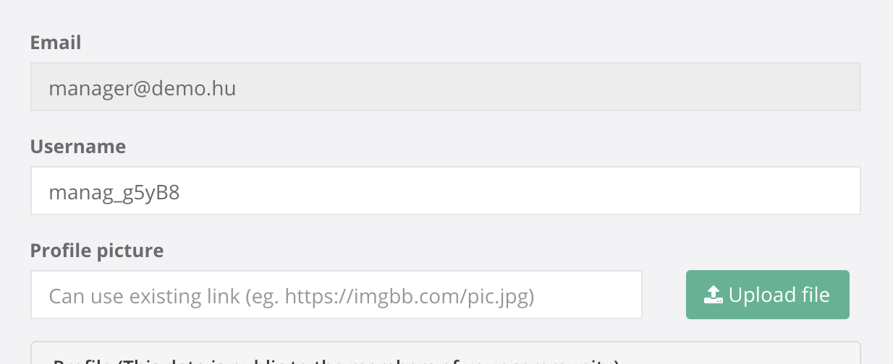
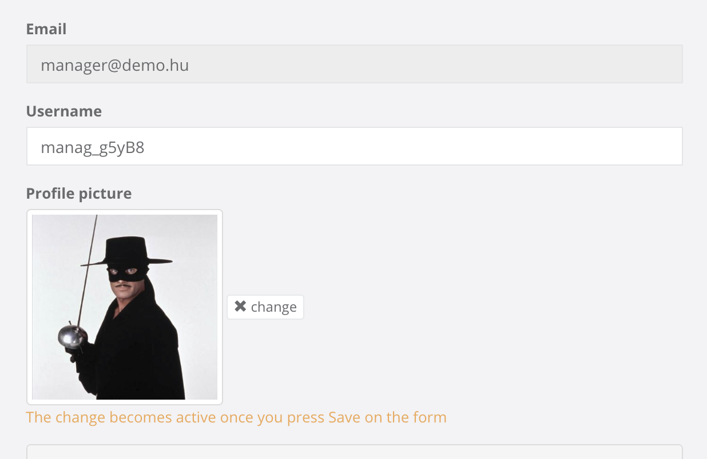

Autoform Ufs
=============

### Description
Upload and manage files with autoForm via [`jalik:ufs`](https://github.com/jalik/jalik-ufs/).

This version allows you to choose between using an external link, or Uploading a file to be stored on the server in a specified collection.

Looks like this before uploading or specifying a link:



After uploading or specifying a link:



### Quick Start:

 - Install `meteor add jalik:ufs` *if not yet installed*
 - Install `meteor add aldeed:autoform` *if not yet installed*
 - Install `meteor add droka:autoform-ufs`

 - Add this config to `simpl-schema` NPM package (depending of the language that you are using):
```javascript
SimpleSchema.setDefaultMessages({
  initialLanguage: 'en',
  messages: {
    en: {
      uploadError: '{{value}}', //File-upload
    },
  }
});
```
 - Create your Files Collection (See [`jalik:ufs`](https://github.com/jalik/jalik-ufs/))
```javascript
```

 - Define your schema and set the `autoform` property like in the example below
```javascript
Schemas = {};
Posts   = new Meteor.Collection('posts');
Schemas.Posts = new SimpleSchema({
  title: {
    type: String,
    max: 60
  },
  picture: {
    type: String,
    autoform: {
      afFieldInput: {
        type: 'fileUpload',
        collection: 'images',
      }
    }
  }
});

Posts.attachSchema(Schemas.Posts);
```

Generate the form with `{{> quickform}}` or `{{#autoform}}` as usual

You also have to have a *Store* by the same name as your collection
(so with the name 'images' in this example).

Code inspired by [`ostrio:autoform-files`](https://github.com/VeliovGroup/meteor-autoform-file/).

